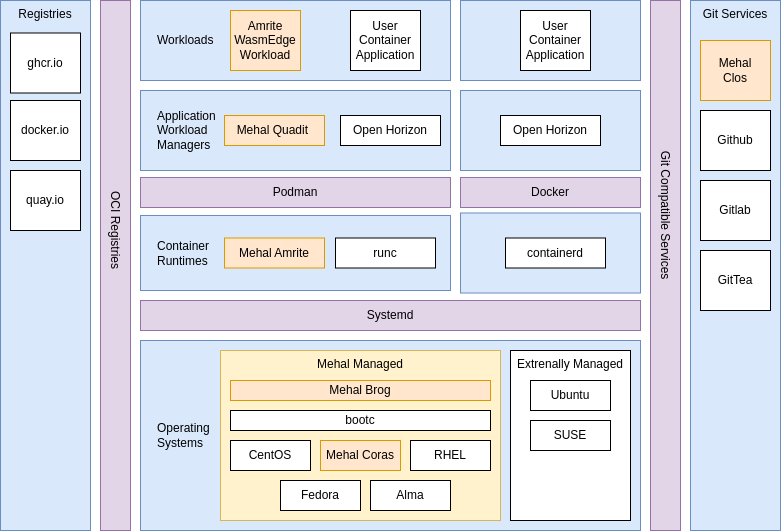

## Welcome to Mehal Technologies!

We provide software and SaaS services to deliver a composable and vertically integrated smart device edge management system. 

We enable autonomous management of operating systems and applications at scale through a modern GitOps approach.  

## What's inside?

1. 🛠️ [Coras](coras/README.md) - An [open source](https://github.com/mehal-tech/open-coras) Operating System built using [image mode](https://github.com/containers/bootc) and based on [Fedora](https://fedoraproject.org/) 

1. 👞 [Brog](brog/README.md) - An [open source](https://github.com/mehal-tech/brog) GitOps client service that manages operating system upgrades and rollbacks

1. ⚙️ [Amrite](amrite/README.md) - An [open source](https://github.com/mehal-tech/amrite) container runtime with support for WASI and OCI Containers based on [crun](https://github.com/containers/crun) and [podman](https://podman.io/). 

1. 🎛️ [Quadit](quadit/README.md) - An [open source](https://github.com/ubiquitous-factory/quadit) GitOps client service to manage container deployments

1. 🕸 [Clos](clos/README.md) - [Software as a Service](https://mehal.tech/login) to co-ordinate the gitops deployments

## We are different because we are composable.

Most vertically integrated IoT technologies are tightly coupled and usually lead to the adoption of specific hardware and operating system. They also tend to be very prescriptive on how builds, deployment and overall management are performed. 

At Mehal Technologies we embrace the cloud native ecosystem approach as much as possible to provide closer alignment with the way your whole business builds and deploys technology. 

Put simply: You shouldn't have to keep a gorilla just because you want a banana. 

The following diagram depicts how this point of view looks in terms of the components in a typical smart edge deployment.

Now lets look at some scenarios: 

Q. I have 1 or 2 services that is unlikely to change in the near future what's the best option? 

   As the [Mehal Coras](https://github.com/mehal-tech/open-coras) is an image mode container you may want to consider just using [Brog]((https://github.com/mehal-tech/brog) to simply manage OS upgrades and rollbacks.

Q. Due to Third Party compatibility issues I must use Ubuntu is there any benefit in using Mehal Technologies?

   Yes - If you are also deploying your own software onto the device you should consider using [Quadit](https://github.com/ubiquitous-factory/quadit)  so you aren't reliant on the providers operating system.

Q. I want the ability to distribute light weight WASI workloads can  Mehal Technologies help? 
   Yes - The [Amrite](https://github.com/mehal-tech/amrite) runtime can be dropped into your own operating systems definitions without any other  Mehal Technologies components. 

Q. I'm currently using my own instance of [Open Horizon](https://open-horizon.github.io/) is there any additional value in adopting Mehal Technologies into my stack? 
   
   Yes - [Brog]((https://github.com/mehal-tech/brog) can provide a way to manage your OS without interfering with your current application management system.

Q. My company has standardised on Circle CI for builds, uses bitbucket for source code and has there own private ECR instance on AWS. All of these services have enterprise controls in place can I still use Mehal Technologies?
   
   Of course - We have intentionally designed the system to integrate with industry standard devops tools - Mehal Technologies aim is to utilse these services for the edge not rewrite them. 

Q. The developers at my company prefer Docker over podman can we still use [coras](https://mehal.tech/login) to manage operating system updates? 

   Absolutely, and you can look at management systems such as Open Horizon to help you with the overall management.

<!--

**Here are some ideas to get you started:**

🙋‍♀️ A short introduction - what is your organization all about?
🌈 Contribution guidelines - how can the community get involved?
👩‍💻 Useful resources - where can the community find your docs? Is there anything else the community should know?
🍿 Fun facts - what does your team eat for breakfast?
🧙 Remember, you can do mighty things with the power of [Markdown](https://docs.github.com/github/writing-on-github/getting-started-with-writing-and-formatting-on-github/basic-writing-and-formatting-syntax)
-->
